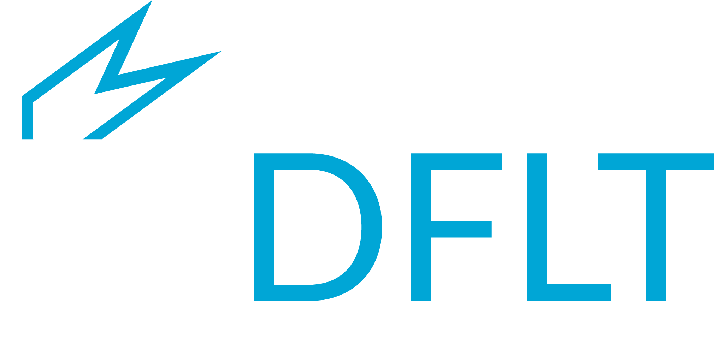

.. image:: _static/logo.png
   :alt: PyDFLT logo (light)
   :class: hero-logo hero-logo--light

**PyDFLT** is designed to help researchers apply and develop Decision Focused Learning (DFL) tools in Python. DFL aims at learning a predictive model that maximizes the decision quality of a downstream decision-making task or optimization model. This problem as a whole is named a predict & optimize or contextual optimization problem. In this setting, the optimization model has some uncertain parameters that correlate with some context or features. If seen as a pure predictive problem, one could aim to maximize predictive accuracy. However, since we know we will use the predictions to make decisions, we aim at maximizing decision quality.

Contents
--------

.. toctree::
   :maxdepth: 1
   :caption: Examples
   :glob:

   examples/*

.. toctree::
   :maxdepth: 1
   :caption: API reference

   api/src
